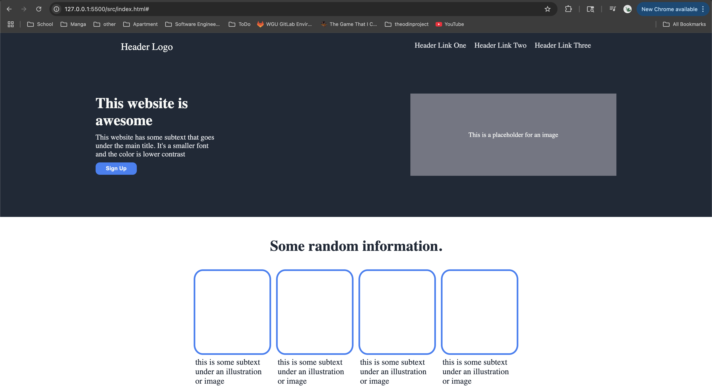
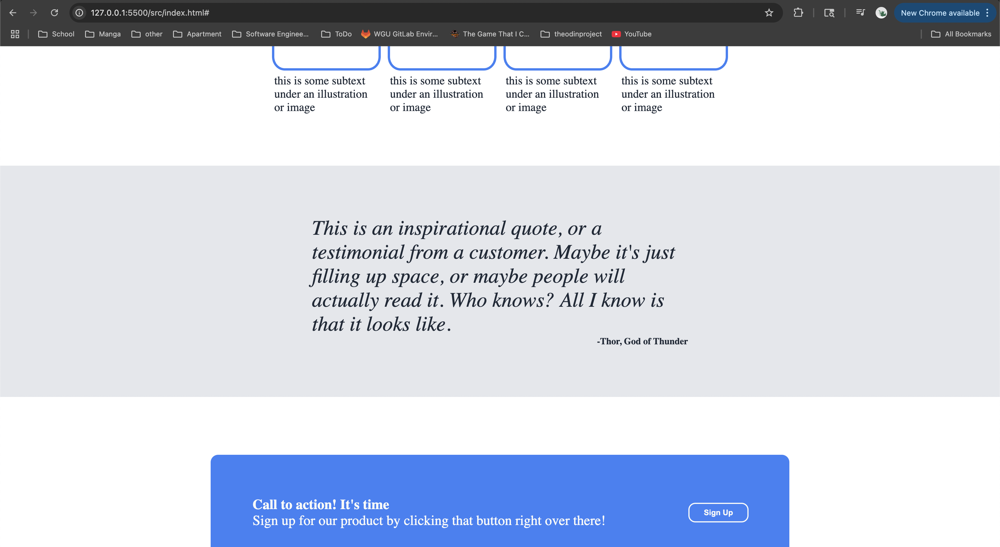
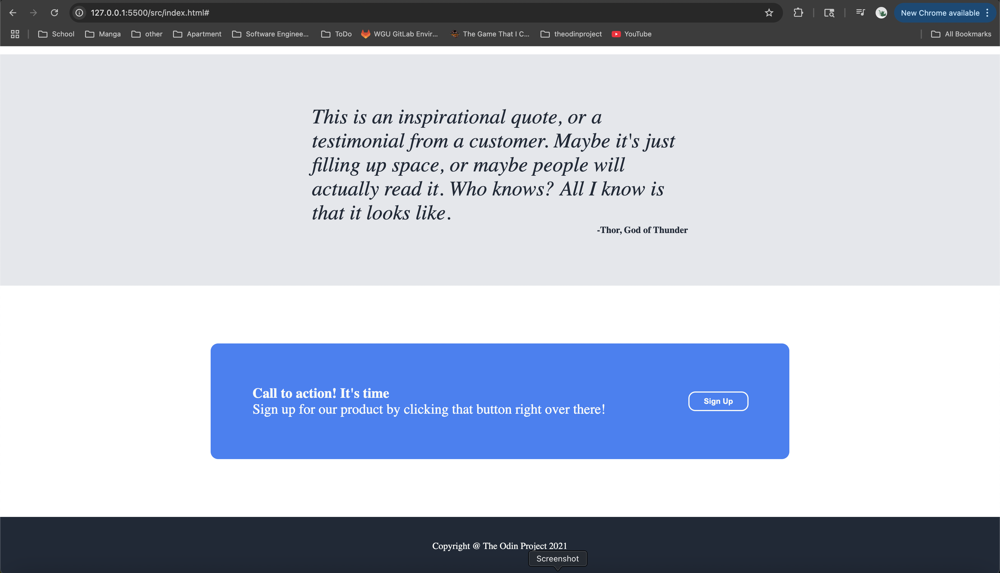

Date: 06/29/2025
Version: 1.0
Course: [The Odin Project: Foundations - Project Landing Page](https://www.theodinproject.com/lessons/foundations-landing-page)

---

## Description

The purpose of this project was to build a landing page design that was provided to us using HTML, CSS, and Flexbox.

---

### Version 1.0

---

## Areas of Improvement

- Add user feedback when hovering over/clicking on buttons and links
- Replace the placeholder content
- Center the subtext for the image containers in the "some random information" section
- Implement functionality for the "sign up" buttons
- Implement functionality for the links to direct to a page/section

---

## Tools

- HTML
- CSS
- Flexbox
- Visual Studio Code
- Git
- GitHub
